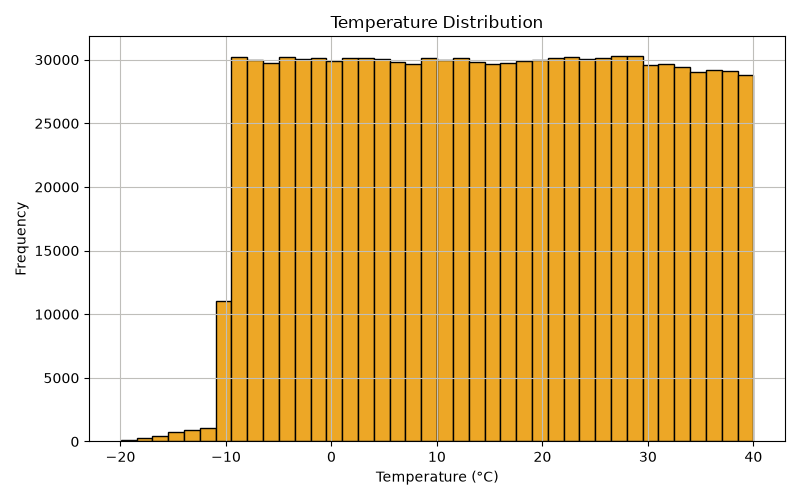
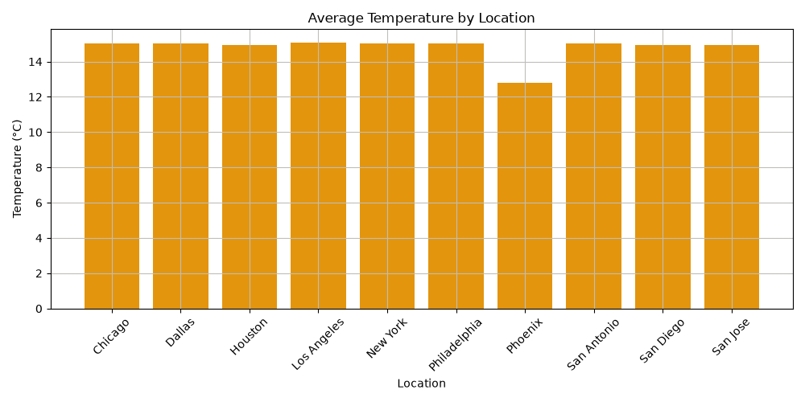
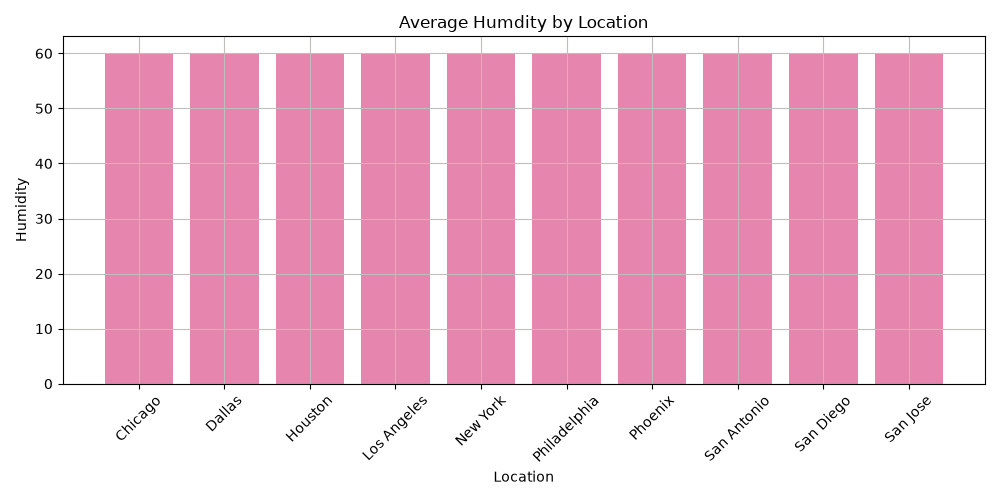
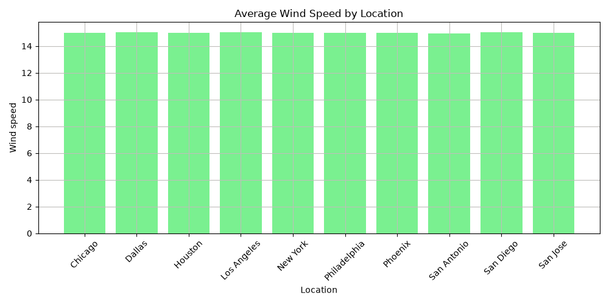
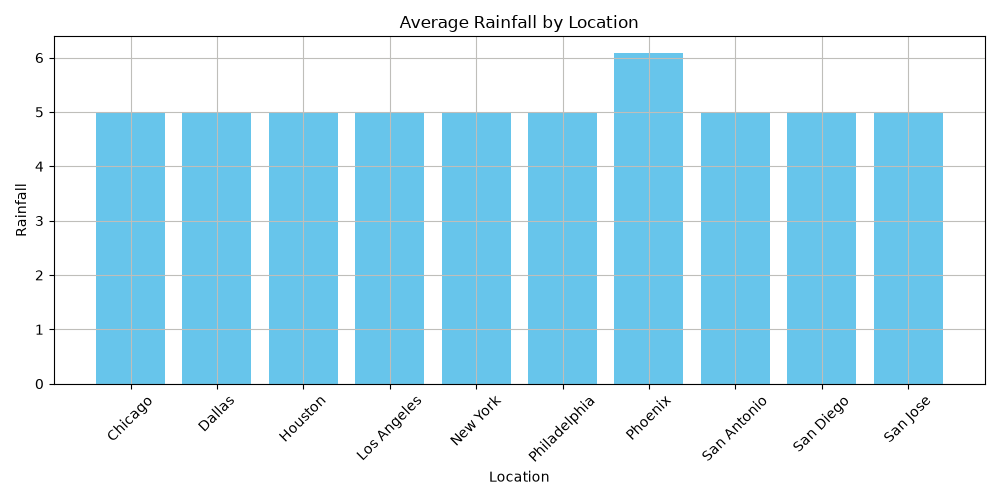
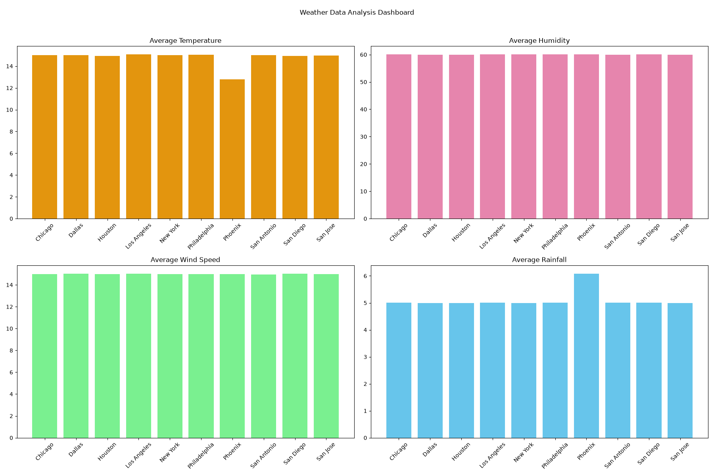

# Weather_Data_Analysis
A Python-based data analysis project that explores weather conditions across multiple locations using Pandas and Matplotlib.

## 📌 Project Overview

This project analyzes a weather dataset containing 100,001 records from 10 different locations.

The analysis focuses on:

- Temperature
- Humidity
- Precipitation
- Wind Speed
- Location-wise weather patterns

The project includes data cleaning, exploratory data analysis, visualization, summary statistics, key insights, and a weather dashboard.

## 🛠️ Technologies Used

- Python
- Pandas
- Matplotlib
- Git
- GitHub

## 📊 Dataset

This project uses real-time weather data collected for multiple locations.

The dataset contains 100,001 weather records with the following features:

- Location
- Date_Time
- Temperature (°C)
- Humidity (%)
- Precipitation (mm)
- Wind Speed (km/h)

  ## 🔄 Project Workflow

1. Loaded the weather dataset
2. Explored the dataset structure
3. Checked data types and missing values
4. Cleaned the dataset
5. Performed exploratory data analysis
6. Calculated weather statistics
7. Analyzed weather conditions by location
8. Created visualizations using Matplotlib
9. Generated key insights
10. Created a weather dashboard

## 📈 Visualizations

### Temperature Distribution



### Average Temperature by Location



### Average Humidity by Location



### Average Wind Speed by Location



### Average Rainfall by Location



## 📊 Weather Dashboard



## 🔍 Key Insights

- Los Angeles has the highest average temperature.
- Chicago has the highest average humidity.
- San Diego has the highest average wind speed.
- Phoenix has the highest average rainfall.
- Weather data was analyzed across 10 locations.

## ▶️ How to Run

### 1. Clone the repository

```bash
git clone https://github.com/iamnehadixit/Weather_Data_Analysis.git